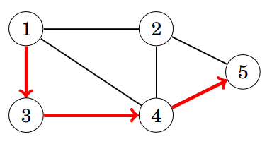
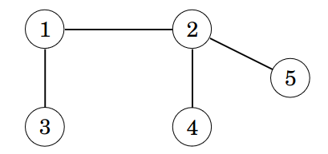

# Graph

## Convention
$n \rightarrow$ Number of nodes\
$m \rightarrow$ Number of edges

## Terminologies
- **Path** leads from one node to another through edges in a graph.
- **Length of Path** is the number of nodes edges in it.\
\
Length of this graph is 3.
- **Cycle** is a path whose first and last node are same.\
In the above graph, $1\rightarrow 2\rightarrow 3\rightarrow 4\rightarrow 1$ is a cycle.
- **Connected** graphs are graphs in which there is a path between any two nodes.\
The following graph is not connected.\

- **Components** are the connected parts of a graph.\
For example: The components of the above graph are: $\{1, 2, 3\}, \{4, 5, 6, 7\}, \{8\}$
- **Tree** is a connected graph of $n$ nodes and $n-1$ edges.\
There is a unique path between any two nodes in a tree.\
The follow graph is a tree.\

- **Directed graphs** are graphs in which the edges are directed in one direction only
- **Weighted graphs** are graphs in which a weight is assigned to every edge\
The weights are often called **edge length**
- **Length of Path** in weighted path is the sum of weight of the edges on the path
- **Adjacent Nodes/Neighbours** are the nodes connected by an edge
- **Degree** of a node is the number of its neighbours
- **Sum of degrees in a graph = $2m$**
- **Sum of degrees in a graph is always even**
